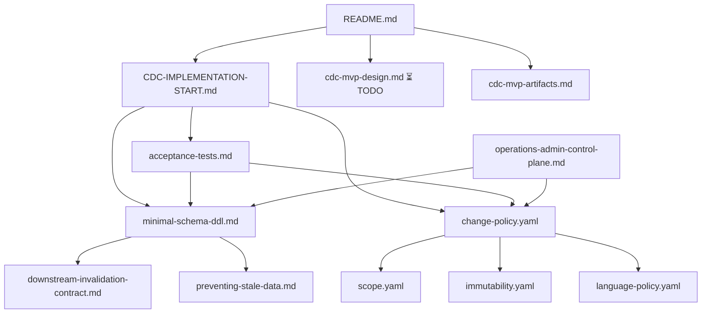

# CDC Documentation Index

**Purpose**: Complete navigation hub for MS-InfoJP Change Data Capture (CDC) system documentation.  
**Last Updated**: 2026-02-02  
**Version**: 1.1.0  
**Status**: Updated with Week 0 prerequisites and risk register

---

## ⚠️ IMPORTANT: Start Here

**Phase 1 Scope Decision (2026-02-02)**: CDC detection only. Ingestion orchestration deferred to Phase 2.

**Before reading any implementation docs, complete Week 0 prerequisites:**
1. ✅ [README.md](README.md) - Read prerequisites section
2. 🔴 Complete Week 0 tasks (CanLII validation, Azure environment, cost modeling)
3. ✅ Review [IMPLEMENTATION-RISKS.md](IMPLEMENTATION-RISKS.md) - Understand project risks
4. ✅ Then proceed to [CDC-IMPLEMENTATION-START.md](CDC-IMPLEMENTATION-START.md)

**Phase 1 vs Phase 2**:
- **Phase 1** (Week 1-3): CDC detection, change classification, DeltaManifest generation
- **Phase 2** (Week 4+): Ingestion pipeline orchestration, stage tracking, variants

---

## Quick Navigation

| **If you want to...** | **Read this first** | **Then this** |
|------------------------|---------------------|---------------|
| **Understand CDC system** | [README.md](README.md) | [cdc-mvp-design.md](cdc-mvp-design.md) ✅ |
| **Validate prerequisites** | [README.md](README.md) Prerequisites | Week 0 Tasks |
| **Start implementation** | [CDC-IMPLEMENTATION-START.md](CDC-IMPLEMENTATION-START.md) | [minimal-schema-ddl.md](minimal-schema-ddl.md) |
| **Understand risks** | [IMPLEMENTATION-RISKS.md](IMPLEMENTATION-RISKS.md) | Risk mitigation strategies |
| **Configure CDC behavior** | [change-policy.yaml](change-policy.yaml) | [scope.yaml](scope.yaml) |
| **Write tests** | [acceptance-tests.md](acceptance-tests.md) | Test fixtures in `tests/fixtures/` |
| **Deploy schema** | [minimal-schema-ddl.md](minimal-schema-ddl.md) | Run `scripts/deploy/create_cosmos_schema.py` |
| **Understand freshness** | [preventing-stale-data.md](preventing-stale-data.md) | Azure AI Search scoring profiles |
| **Operate the system** | [operations-admin-control-plane.md](operations-admin-control-plane.md) | Phase 2 roadmap |
| **Set up dev environment** | `DEVELOPMENT.md` (TBD) | Week 0 Task 0.4 |

---

## Complete File Catalog

### 📋 Entry Points (Start Here)

| File | Lines | Status | Purpose |
|------|-------|--------|---------|
| **[README.md](README.md)** | ~220 | ✅ Complete | System overview, **Week 0 prerequisites**, architecture summary |
| **[CDC-IMPLEMENTATION-START.md](CDC-IMPLEMENTATION-START.md)** | ~1200 | ✅ Complete | **Week 0-3** implementation guide with code patterns |
| **[IMPLEMENTATION-RISKS.md](IMPLEMENTATION-RISKS.md)** | 350 | ✅ **NEW** | Risk register with 8 tracked risks and mitigation strategies |

### 🏗️ Architecture & Design

| File | Lines | Status | Purpose |
|------|-------|--------|---------|
| **[cdc-mvp-design.md](cdc-mvp-design.md)** | 671 | ✅ Complete | Two-plane architecture, design decisions, CDC patterns |
| **[preventing-stale-data.md](preventing-stale-data.md)** | 307 | ✅ Complete | Freshness-aware RAG architecture, recency boosting |
| **[cdc-mvp-artifacts.md](cdc-mvp-artifacts.md)** | 480 | ✅ Complete | Build deliverables, acceptance criteria, Phase 1 scope |

### 📐 Policy Pack (Configuration)

| File | Lines | Status | Purpose |
|------|-------|--------|---------|
| **[change-policy.yaml](change-policy.yaml)** | 345 | ✅ Complete | 8 change classes, downstream actions, classification rules (v0.1.0) |
| **[scope.yaml](scope.yaml)** | 367 | ✅ Complete | 13 corpus scope definitions with SLO tiers, rolling/fixed windows |
| **[immutability.yaml](immutability.yaml)** | 408 | ✅ Complete | Polling frequency rules (daily/weekly/monthly), immutability classes |
| **[language-policy.yaml](language-policy.yaml)** | 583 | ✅ Complete | EN/FR/BI handling, chunking rules, embedding strategy |

### 🗄️ Technical Specifications

| File | Lines | Status | Purpose |
|------|-------|--------|---------|
| **[minimal-schema-ddl.md](minimal-schema-ddl.md)** | ~1000 | ✅ Complete | 13-table Cosmos DB schema (includes cdc_source) with partition keys, indexes, example data |
| **[downstream-invalidation-contract.md](downstream-invalidation-contract.md)** | 653 | ✅ Complete | RAG pipeline contract, 11 action types, change_event processing |
| **[cdc-output-contract.md](cdc-output-contract.md)** | ~150 | ⏳ Week 1 | DeltaManifest + CDC_COMPLETE event specification |
| **[acceptance-tests.md](acceptance-tests.md)** | 564 | ✅ Complete | 26 Given/When/Then test specifications (categories A-K) |

### 🛠️ Operations & Admin

| File | Lines | Status | Purpose |
|------|-------|--------|---------|
| **[operations-admin-control-plane.md](operations-admin-control-plane.md)** | 590 | ✅ Complete | Phase 2+ admin UI design, monitoring dashboard, alerting |
| **[IMPLEMENTATION-RISKS.md](IMPLEMENTATION-RISKS.md)** | 350 | ✅ **NEW** | Risk register (8 risks), mitigation strategies, escalation process |

### 📂 Week 0 Deliverables (To Be Created)

| File | Lines | Status | Purpose |
|------|-------|--------|---------|
| **`docs/adr/001-canlii-data-access-strategy.md`** | TBD | ⏳ Week 0 | ADR documenting CanLII API investigation results |
| **`docs/infrastructure/azure-environment-validated.md`** | TBD | ⏳ Week 0 | Azure subscription, resources, RBAC validation |
| **`docs/cost-analysis.xlsx`** | N/A | ⏳ Week 0 | Cost breakdown, budget approval, alerts |
| **`DEVELOPMENT.md`** | TBD | ⏳ Week 0 | Local dev setup, Cosmos DB emulator, debugging |
| **`scripts/dev/test-azure-connectivity.py`** | TBD | ⏳ Week 0 | Azure services connectivity test script |
| **`scripts/deploy/create_cosmos_schema.py`** | TBD | ⏳ Week 1 | Cosmos DB schema deployment with validation |
| **`tests/fixtures/generate_canlii_fixtures.py`** | TBD | ⏳ Week 1 | Mock CanLII data generator for tests |
| **`pytest.ini`** | TBD | ⏳ Week 1 | pytest configuration |
### 📂 Phase 2 Deliverables (Deferred)

| File | Lines | Status | Purpose |
|------|-------|--------|---------|------|
| **`ingestion-pipeline-spec.md`** | ~400 | 📅 Phase 2 | Pipeline orchestration, stage dependencies, variants |
| **`manifest-formats.yaml`** | ~200 | 📅 Phase 2 | JSON schemas for Input/Output/Error/Evidence manifests |
| **Schema extensions** | ~150 | 📅 Phase 2 | ingestion_run, ingestion_stage_run tables |
| **Operational controls** | TBD | 📅 Phase 2 | Pause/resume, stage retry, A/B testing UI |
---

## Reading Paths

### 🎯 Path 0: Week 0 Prerequisites (MUST DO FIRST)

**Time**: 2-3 hours  
**Outcome**: Validated readiness to begin implementation

1. **[README.md](README.md)** Prerequisites section (15 min) - Understand blocking tasks
2. **[IMPLEMENTATION-RISKS.md](IMPLEMENTATION-RISKS.md)** (30 min) - Review RISK-001, RISK-002, RISK-003
3. **[CDC-IMPLEMENTATION-START.md](CDC-IMPLEMENTATION-START.md)** Week 0 section (45 min) - Task details
4. **Execute Week 0 Tasks** (10-18 hours over 1-2 days):
   - Task 0.1: CanLII API investigation
   - Task 0.2: Azure environment validation
   - Task 0.3: Cost modeling
   - Task 0.4: Dev environment setup
5. **Exit Criteria Check**: All 4 deliverables complete ✅

---

### 🎯 Path 1: New Implementer (First Day - After Week 0)

1. **[README.md](README.md)** (15 min) - Get oriented with CDC purpose and architecture
2. **[CDC-IMPLEMENTATION-START.md](CDC-IMPLEMENTATION-START.md)** (45 min) - Read Week 1 plan
3. **[minimal-schema-ddl.md](minimal-schema-ddl.md)** (30 min) - Understand 12-table schema
4. **[change-policy.yaml](change-policy.yaml)** (20 min) - Learn 8 change classes and actions
5. **[acceptance-tests.md](acceptance-tests.md)** (30 min) - Review test scenarios A1-A3, B1-B3

**Time**: ~2.5 hours  
**Outcome**: Ready to deploy Cosmos DB schema and start coding

---

### 🎯 Path 2: Architect / Reviewer

1. **[README.md](README.md)** (10 min) - System overview
2. **[cdc-mvp-design.md](cdc-mvp-design.md)** (30 min) - Design principles and trade-offs
3. **[preventing-stale-data.md](preventing-stale-data.md)** (20 min) - Freshness architecture
4. **[downstream-invalidation-contract.md](downstream-invalidation-contract.md)** (30 min) - RAG pipeline integration
5. **[change-policy.yaml](change-policy.yaml)** (15 min) - Classification rules
6. **[minimal-schema-ddl.md](minimal-schema-ddl.md)** (20 min) - Schema design

**Time**: ~2 hours  
**Outcome**: Can review architecture, approve design decisions

---

### 🎯 Path 3: QA / Test Engineer

1. **[README.md](README.md)** (10 min) - System context
2. **[acceptance-tests.md](acceptance-tests.md)** (60 min) - All 26 test specifications
3. **[change-policy.yaml](change-policy.yaml)** (15 min) - Expected behaviors
4. **[scope.yaml](scope.yaml)** (15 min) - Corpus scope rules
5. **[immutability.yaml](immutability.yaml)** (15 min) - Polling frequency expectations

**Time**: ~2 hours  
**Outcome**: Can write pytest tests, validate CDC runs

---

### 🎯 Path 4: Operator / SRE

1. **[README.md](README.md)** (10 min) - System overview
2. **[operations-admin-control-plane.md](operations-admin-control-plane.md)** (45 min) - Monitoring and alerting
3. **[scope.yaml](scope.yaml)** (15 min) - SLO tiers (1hr/24hr/weekly)
4. **[immutability.yaml](immutability.yaml)** (10 min) - Polling schedules
5. **[minimal-schema-ddl.md](minimal-schema-ddl.md)** (15 min) - Query examples for troubleshooting

**Time**: ~1.5 hours  
**Outcome**: Can monitor CDC health, respond to SLO violations

---

## Glossary

### Core Concepts (Phase 1)

| Term | Definition | Where Defined |
|------|------------|---------------|
| **case_id** | Immutable identifier for a case entity (survives external key changes) | [minimal-schema-ddl.md](minimal-schema-ddl.md#L85) |
| **case_version** | Versioned snapshot of a case at a point in time | [minimal-schema-ddl.md](minimal-schema-ddl.md#L195) |
| **cdc_source** | Configuration for change detection source (CanLII API, SharePoint, etc.) | [minimal-schema-ddl.md](minimal-schema-ddl.md) |
| **change_class** | Classification of detected change: structural/availability/metadata/content/cosmetic/unreachable/deleted | [change-policy.yaml](change-policy.yaml#L26-L33) |
| **change_event** | One detected change with provenance, classification, and actions taken | [minimal-schema-ddl.md](minimal-schema-ddl.md#L380) |
| **corpus_id** | Identifier for a managed corpus (e.g., "jp-jurisprudence") | [minimal-schema-ddl.md](minimal-schema-ddl.md#L711) |
| **delta_manifest** | JSON artifact listing changes detected in a poll_run | [cdc-output-contract.md](cdc-output-contract.md) |
| **poll_run** | One CDC execution record (always created, even if no changes) | [minimal-schema-ddl.md](minimal-schema-ddl.md#L329) |
| **scope_id** | Reproducible partition for CDC (e.g., "SST-GD-EN-rolling-24mo") | [scope.yaml](scope.yaml#L16) |
| **SLO tier** | Freshness guarantee level: 1=<1hr, 2=<24hr, 3=weekly | [scope.yaml](scope.yaml#L50-L52) |

### Phase 2 Concepts (Deferred)

| Term | Definition | Status |
|------|------------|--------|
| **ingestion_run** | One ingestion pipeline execution | 📅 Phase 2 |
| **ingestion_stage_run** | One pipeline stage execution (acquire/transform/embed/index) | 📅 Phase 2 |
| **ingestion_variant** | A/B testing configuration (e.g., "chunking-v2-overlap-200") | 📅 Phase 2 |
| **evidence_manifest** | Validation results for audit compliance | 📅 Phase 2 |

### Change Classes (8 Total)

| Change Class | Description | Downstream Actions | Example |
|--------------|-------------|-------------------|---------|
| **structural** | New case discovered or case disappeared | Register case, create version, fetch artifacts | CanLII adds new SST-GD decision |
| **availability** | Language or artifact type changed | Fetch new artifact, re-extract, re-chunk, re-embed | EN decision now has FR translation |
| **metadata_meaningful** | Searchable metadata changed (tribunal, decision_date, etc.) | Update index metadata only (no re-embed) | Decision date corrected |
| **metadata_nonmeaningful** | Internal bookkeeping changed (ETag, last_modified timestamp) | No action (cosmetic) | CanLII updates server timestamp |
| **content** | PDF or extracted text changed | Re-extract, re-chunk, delta embed, update index | Court amends published decision |
| **cosmetic** | HTML formatting changed but text unchanged | No action | CanLII redesigns case page |
| **unreachable** | Temporary 5xx error or network failure | Retry with exponential backoff | CanLII API timeout |
| **deleted** | Permanent 404/410 or explicit removal | Mark deleted, create tombstone in index | Decision withdrawn |

**Reference**: [change-policy.yaml](change-policy.yaml#L26-L146)

### Downstream Actions (11 Total)

| Action | Trigger | Purpose |
|--------|---------|---------|
| `update_registry` | structural | Register new case in `case` table |
| `fetch_artifact` | structural, availability, content | Download PDF/HTML from CanLII |
| `extract_text` | New artifact | OCR or HTML→text via enrichment pipeline |
| `generate_chunks` | New/changed text | Delta chunking (only changed sections) |
| `embed_chunks` | New chunks | Generate embeddings via text-embedding-3-small |
| `update_index` | Changed content | Upsert to Azure AI Search with freshness metadata |
| `update_index_metadata_only` | metadata_meaningful | Update search index metadata without re-embedding |
| `mark_withdrawn_or_deleted` | deleted | Soft delete (is_deleted=true in index) |
| `update_index_tombstone` | deleted (after retention) | Hard delete marker |
| `record_failure` | unreachable, errors | Log to change_event for audit |
| `retry_with_backoff` | unreachable | Exponential backoff retry logic |

**Reference**: [change-policy.yaml](change-policy.yaml#L68-L72)

---

## Immutability Classes (3 Total)

| Class | Description | Polling Frequency | Example Tribunals |
|-------|-------------|-------------------|-------------------|
| **mutable** | Decisions may be amended/corrected post-publication | Daily | SST-GD, SST-AD |
| **mostly_immutable** | Rarely changed after publication | Weekly | FC, FCA |
| **fully_immutable** | Never changed once published | Monthly | SCC |

**Reference**: [immutability.yaml](immutability.yaml#L16-L90)

---

## SLO Tiers (3 Levels)

| Tier | Freshness Guarantee | Polling Frequency | Use Case |
|------|---------------------|-------------------|----------|
| **1** | <1 hour staleness | Continuous/hourly | Mission-critical corpora, real-time legal advice |
| **2** | <24 hour staleness | Daily | Standard jurisprudence (most cases) |
| **3** | <7 day staleness | Weekly | Historical archives, rarely-updated courts |

**Reference**: [scope.yaml](scope.yaml#L50-L52), [immutability.yaml](immutability.yaml#L131-L166)

---

## File Dependencies

---

## Version History

| Version | Date | Changes | Author |
|---------|------|---------|--------|
| 1.1.0 | 2026-02-02 | Updated with Week 0 prerequisites and risk register | Implementation Team |
| 1.2.0 | 2026-02-02 | Phase 1 scope decision: CDC detection only, ingestion orchestration deferred to Phase 2 | Implementation Team |
| 1.0.0 | 2026-01-28 | Initial CDC-INDEX.md creation with complete file catalog, 4 reading paths, glossary | Implementation Team |

---

## Next Steps

### Immediate (Next 48 Hours)
1. ✅ **Complete Week 0 prerequisites** (10-18 hours) - BLOCKING
   - Task 0.1: CanLII API investigation
   - Task 0.2: Azure environment validation
   - Task 0.3: Cost modeling
   - Task 0.4: Dev environment setup

### Week 1 (After Week 0 Complete)
1. **Deploy enhanced schema** using [minimal-schema-ddl.md](minimal-schema-ddl.md)
   - Includes new `cdc_source` table
   - Add `delta_manifest_uri` to `poll_run`
2. **Create [cdc-output-contract.md](cdc-output-contract.md)** - DeltaManifest specification (~150 lines)
3. **Begin Week 1 tasks** from [CDC-IMPLEMENTATION-START.md](CDC-IMPLEMENTATION-START.md)

### Phase 2 (Week 4+ / Post-Validation)
- Ingestion pipeline orchestration
- Stage tracking (ingestion_run, ingestion_stage_run)
- Variant system (A/B testing)
- Operational controls (pause/resume, retry)

---

**Status**: Phase 1 scope defined, Week 0 blocking ⏳  
**Phase**: Phase 1 (CDC Detection Only)  
**Contact**: Development Team  
**Last Review**: 2026-02-02
